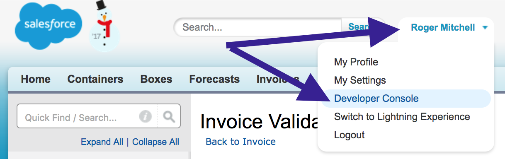
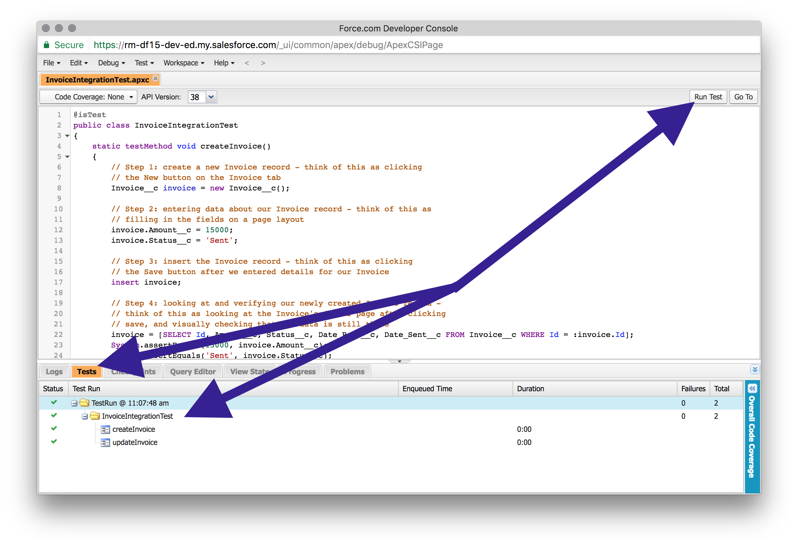
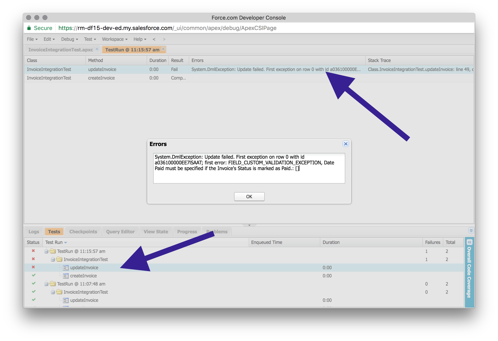

# Test Driven App Building: A Scalable Way to Testing Your Declarative Apps on Salesforce

**Test Driven App Building** is similar to writing a test for our Apex code; it proves that our declarative apps are functioning the way that we intended to build them, and alerts us to when a change is causing them to (potentially) function in a way that we didn't expect.

We can implement **Test Driven App Building** in two different ways: blue pill, red pill?

- **Blue Pill**: write what we've deployed, then manually test it every deployment
- **Red Pill**: write tests for what we've deployed, then run these tests every deployment

I'm a bit biased, but the first option sounds like a lot of work and has room for error, and the second option sounds like time to get a cup of coffee while Salesforce validates the Rosetta Stone.

If we choose the **red pill**, it means we roll up our sleeves and write a little Apex, but we benefit heaps of time for every deployment thereafter.

## Hold on, we want me to write Apex for every workflow rule?

No way! At least, not necessarily. Salesforce allows us to build and deploy changes to our end users in a quick, agile manner, and the end goal is to ensure that our end users have the best experience possible.

Larger business processes (think: an account onboarding process) benefit from **Test Driven App Building**, as these are critical to our organization's process and our end users' ability to do their work. Smaller business processes can also benefit from **Test Driven App Building** when the process has a lot of volume or occurs many times in a given time period, or can cause systems to no longer be in sync (think: integrations).

## Ok, I'm skeptical... but willing to give this a shot.

Great! Let's consider a use case where we have a custom integration with our finance team's ERP system, and see how **Test Driven App Building** can help troubleshoot the root cause.

Universal Containers has an ERP system that manages customer invoices, and a custom integration pushes this data into Salesforce on a nightly basis. we've noticed that our numbers are not adding up, as the Finance Team suggests invoices are being paid, but the Sales Team still sees unpaid invoices in Salesforce. What happened? Is the integration not working? Did someone change the integration jobs, or did someone change something in Salesforce?

Custom integrations may not involve any Apex code, and may rely upon the existing set of APIs provided by Salesforce. We're a bit in the dark here.

Let's rewind the clock and pretend that we had created a test that covers our integration scenario. Our integration creates and updates Invoice records, and we know the set of fields included when the integration was first deployed.

Alright, let's fast-forward back to the moment we have an email thread with the Finance and Sales Teams about a discrepancy in invoice numbers. We jump into Salesforce, open up the Dev Console, and run our **InvoiceIntegrationTest**!

A bunch of seconds pass... (hey, tests aren't instant y'all!)

**... and we see that our test passes!**
Great news, we reply to the thread that the integration test shows everything works from the Salesforce side, so the next step in troubleshooting is to check with the team that built out the integration.

**... and we see that our test fails!**
Yikes! What does the error message say? Is it a `field_custom_validation_exception`? It seems like there was a change in Salesforce that caused this integration test to fail, so we can advise the Finance and Sales Teams that we think the root cause is in Salesforce, and we're checking what changed in Salesforce since the integration was deployed.

## Wow, that's a lot faster than the hours I've spent in the past!

Even better (regardless if the test passed or failed)! Since you're still with me, let's nerd out a bit and write a sample Apex test for this Invoice scenario.

Start out by logging into your sandbox (or Developer Edition) org and opening the Developer Console.



We'll click **File > New > Apex Class**, and give our test a name like **InvoiceIntegrationTest**.

Salesforce automatically generates some of the Apex code for us, and we'll want to modify this slightly. Note that we're including `@isTest` to identify that this is an Apex test class.

```java
@isTest
public class InvoiceIntegrationTest 
{

}
```

There are two different scenarios that we wish to test: creating an Invoice, and updating an Invoice. Each of these scenarios will have its own **test method** in our Apex test class.

```java
@isTest
public class InvoiceIntegrationTest
{
	static testMethod void createInvoice()
	{

	}

	static testMethod void updateInvoice()
	{

	}
}
```

Let's handle the `createInvoice` part first. We're going to perform 4 different steps as part of this test:

1. Create a new Invoice record: think of this as clicking the "New" button on the Invoice tab
1. Set some of the fields on the Invoice record: think of this as filling in fields on a page layout
1. Insert the Invoice to Salesforce: think of this as clicking the "Save button" on a page layout
1. Check that our fields have the values that we expect: think of this as looking at the Invoice's detail page and visually checking some of the fields

```java
static testMethod void createInvoice()
{
    // Step 1
    Invoice__c invoice = new Invoice__c();
    
    // Step 2
    invoice.Amount__c = 15000;
    invoice.Status__c = 'Sent';
    
    // Step 3
    insert invoice;
    
    // Step 4
    invoice = [SELECT Id, Amount__c, Status__c, Date_Paid__c, Date_Sent__c FROM Invoice__c WHERE Id = :invoice.Id];
    System.assertEquals(15000, invoice.Amount__c);
    System.assertEquals('Sent', invoice.Status__c);
}
```

Our next step is to handle the `updateInvoice` logic. We're going to piggy back on our `createInvoice` test, but include 2 additional steps since we need to update something about the invoice we create!

1. Create a new Invoice record: same as `createInvoice` step 1
1. Set some of the fields on the Invoice record: same as `createInvoice` step 2
1. Insert the Invoice to Salesforce: same as `createInvoice` step 3
1. Change the status field on the Invoice record: think of this as clicking Edit on an Invoice record and changing the Status field
1. Updating the Invoice record: think of this as clicking the "Save" button after we edited a field
1. Check that our fields have the values that we expect: same as `createInvoice` step 4

```java
static testMethod void updateInvoice()
{
    // Step 1
    Invoice__c invoice = new Invoice__c();
    
    // Step 2
    invoice.Amount__c = 15000;
    invoice.Status__c = 'Sent';
    
    // Step 3
    insert invoice;
    
    // Step 4
    invoice.Status__c = 'Paid';
    
    // Step 5
		update invoice;

    // Step 6
    invoice = [SELECT Id, Amount__c, Status__c, Date_Paid__c, Date_Sent__c FROM Invoice__c WHERE Id = :invoice.Id];
    System.assertEquals(15000, invoice.Amount__c);
    System.assertEquals('Paid', invoice.Status__c);
}
```

Awesome! We just built out two tests in our Apex class, and we're ready to click the **Run Test** button. We'll see the results appear in the **Tests** tab at the bottom of Developer Console; green checks are good, and red x are bad.



## What happens if my test fails?

Great question! Let's create a new validation rule on the Invoice object that will throw an error if our Invoice Status is "Paid" but the Date Paid field is blank.

```text
AND( ISPICKVAL( Status__c, "Paid" ), ISBLANK( Date_Paid__c ))
```

Pop back to Developer Console and click **Run Test** again, and we'll see that one of our tests is now failing in the **Tests** tab. The reason why this test started to fail is because we have a validation rule that prevents **Step 5** from saving the Invoice, since our test is not setting the Date Paid.



Jumping back to our earlier scenario with Universal Containers, we can see how an innocuous validation rule can potentially cause unexpected results. With our new **InvoiceIntegrationTest**, we're able to see if our changes to the org's configuration will impact any critical business processes, even if these business processes don't involve Apex code!

## Dang! Test Driven App Building is neat!

I'm glad you agree! If you want to install the Invoice object with the validation rule and Apex test that we wrote together, feel free to use either this [production](https://login.salesforce.com/packaging/installPackage.apexp?p0=04t61000000kf6z) or [sandbox](https://test.salesforce.com/packaging/installPackage.apexp?p0=04t61000000kf6z) link to install into your org.

I'd also love to hear your thoughts and use cases as you embark on your first **Test Driven App Building** experience! Leave a comment below or throw a mention [@RogerMitchell](https://www.twitter.com/rogermitchell) on Twitter with any questions, comments, etc!